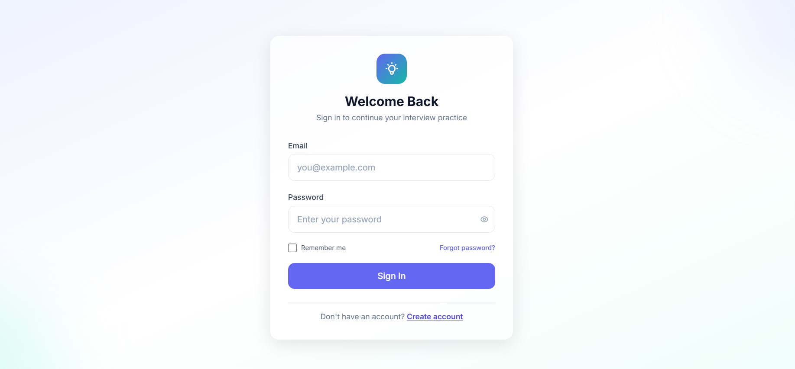
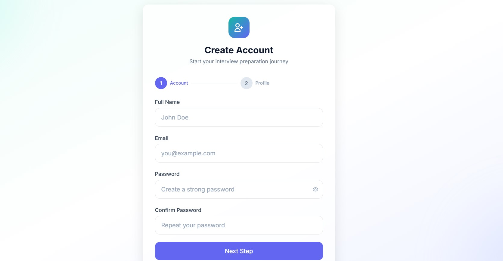
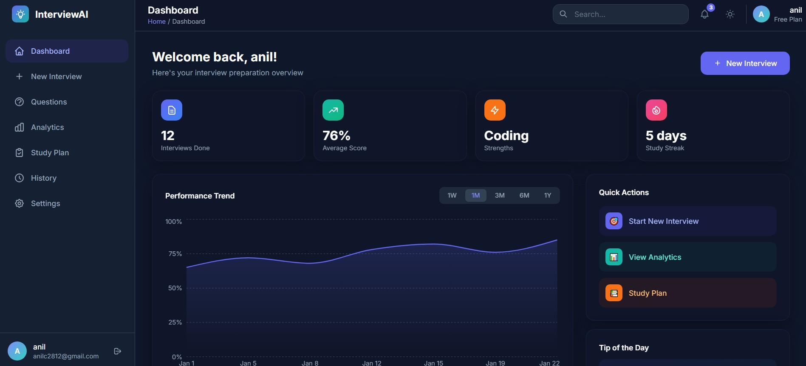
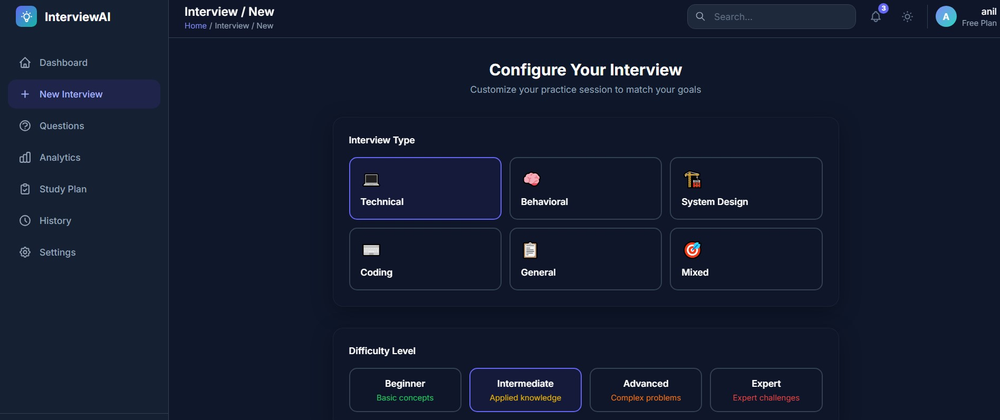
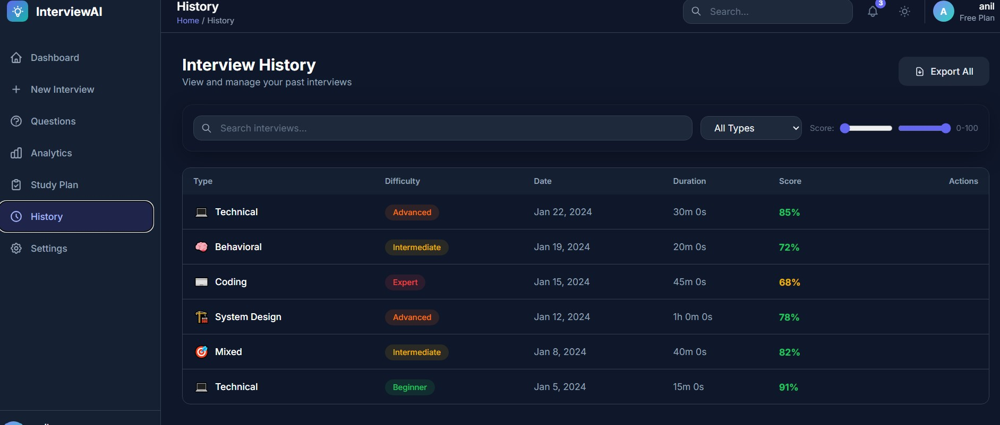
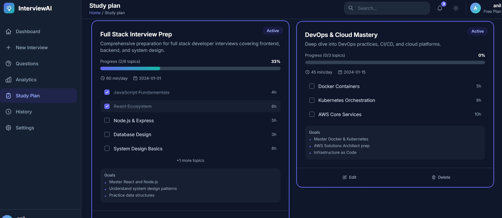
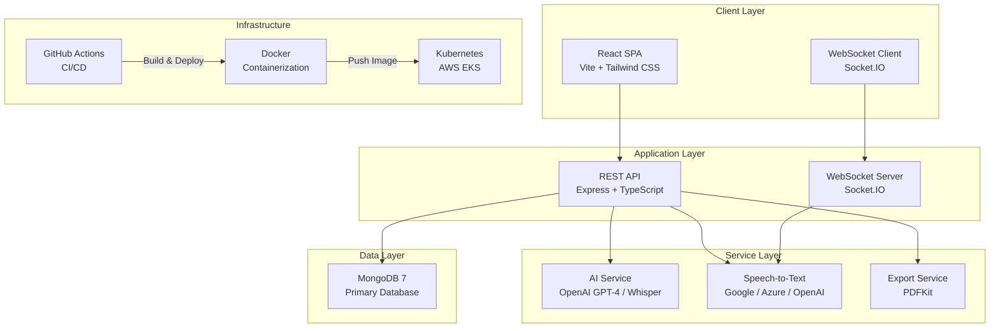
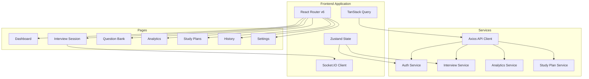
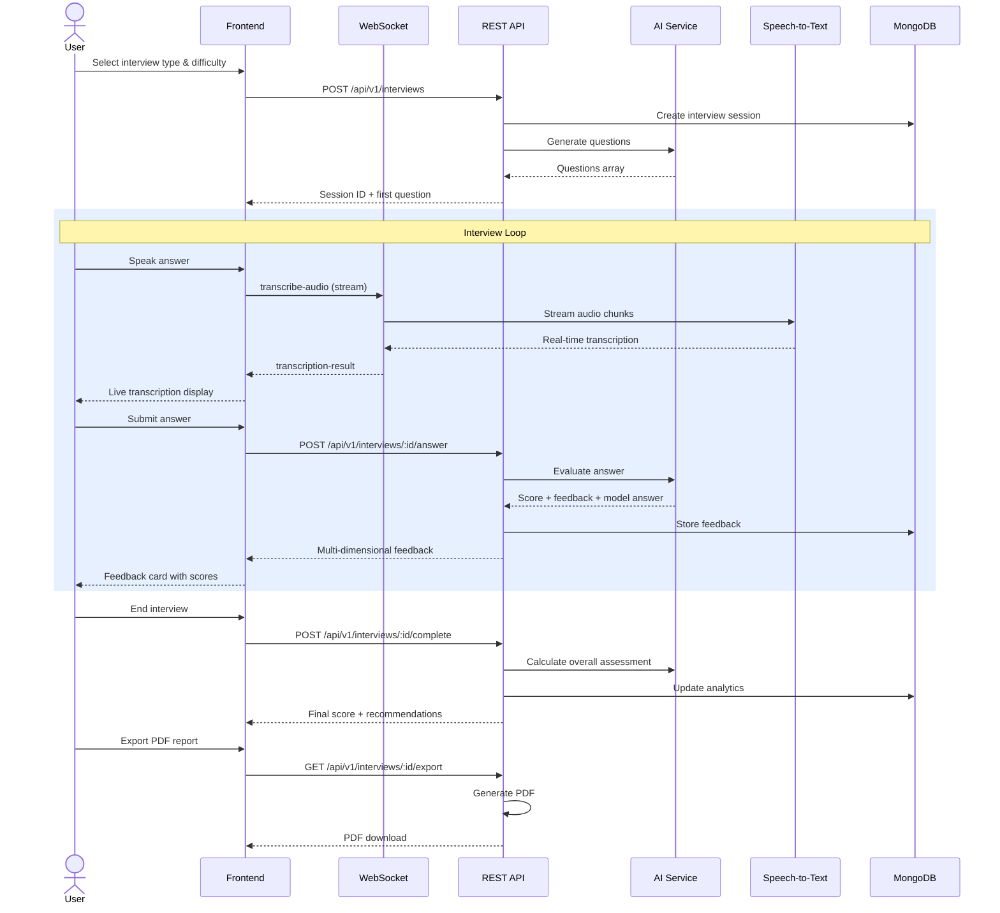
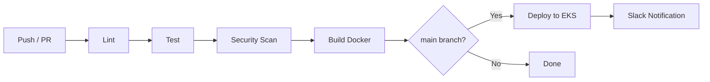

<div align="center">

# AI Interview Assistant

**Master your next technical interview with AI-powered practice, real-time feedback, and personalized study plans**
**Live Url- https://ai-interview.sirvisamaj.online/**
[](https://www.typescriptlang.org/)
[](https://reactjs.org/)
[](https://nodejs.org/)
[](https://expressjs.com/)
[](https://www.mongodb.com/)
[](https://vitejs.dev/)
[](https://tailwindcss.com/)
[](https://socket.io/)
[](https://www.docker.com/)
[](https://kubernetes.io/)
[](https://openai.com/)
[](https://vercel.com/)

[](https://github.com/your-org/ai-interview-assistant/actions)
[](LICENSE)
[](CONTRIBUTING.md)

</div>

---
**Live Url- https://ai-interview.sirvisamaj.online/**
## Table of Contents

- [Features](#features)
- [Architecture](#architecture)
- [Tech Stack](#tech-stack)
- [Data Flow](#data-flow)
- [Getting Started](#getting-started)
- [Project Structure](#project-structure)
- [API Overview](#api-overview)
- [AI & Real-time Features](#ai--real-time-features)
- [Deployment](#deployment)
- [CI/CD Pipeline](#cicd-pipeline)
- [Monitoring & Observability](#monitoring--observability)
- [Contributing](#contributing)

---

## Features

<div align="center">

| | Feature | Description |
|:---:|---|---|
| :brain: | **AI-Powered Interviews** | Practice with dynamic questions generated and evaluated by GPT-4 |
| :microphone: | **Speech-to-Text** | Answer with your voice — real-time transcription via WebSocket |
| :star: | **Instant Feedback** | Multi-dimensional scoring (accuracy, clarity, structure, relevance) |
| :bar_chart: | **Performance Analytics** | Track progress, strengths, weaknesses across categories |
| :notebook: | **Personalized Study Plans** | AI-generated plans based on your performance data |
| :page_facing_up: | **PDF Reports** | Export interview summaries and study plans |
| :seedling: | **5 Interview Categories** | Coding, DevOps, Cloud, System Design, Behavioral |
| :shield: | **Enterprise Security** | JWT auth, rate limiting, RBAC, Helmet, CORS |
| :whale: | **Containerized** | Docker Compose for local, Kubernetes for production |
| :chart_with_upwards_trend: | **Full Observability** | Prometheus metrics, Grafana dashboards, Fluent Bit logging |

</div>

---

---

## Screenshots

<div align="center">

### Login & Signup

<p float="left">
  
  
</p>

### Dashboard

<p float="left">
  
  
</p>

### History & Study Plan

<p float="left">
  
  
</p>

</div>


## Architecture

### System Architecture



### Frontend Component Architecture



---

## Tech Stack

<details>
<summary><b>Backend</b></summary>

| Technology | Purpose |
|-----------|---------|
| Node.js 18 + TypeScript 5.3 | Runtime |
| Express 4.18 | HTTP framework |
| Mongoose 8.0 + MongoDB 7 | Database |
| Socket.IO 4.7 | Real-time WebSocket |
| OpenAI API 4.20 | GPT-4, Whisper |
| bcryptjs + jsonwebtoken | Auth (JWT) |
| helmet + cors + express-rate-limit | Security |
| winston + morgan + fluent-bit | Logging |
| prom-client | Prometheus metrics |
| pdfkit | PDF generation |
| Jest + supertest + mongodb-memory-server | Testing |

</details>

<details>
<summary><b>Frontend</b></summary>

| Technology | Purpose |
|-----------|---------|
| React 18 + TypeScript 5.3 | UI framework |
| Vite 5 | Bundler & dev server |
| Tailwind CSS 3.3 | Styling |
| React Router v6 | Client routing |
| Zustand 4.4 | State management |
| TanStack React Query 5.13 | Server state |
| Axios 1.6 | HTTP client |
| Socket.IO Client 4.7 | Real-time |
| Recharts 2.10 | Analytics charts |
| Framer Motion 10.16 | Animations |
| React Hook Form 7.49 | Forms |

</details>

<details>
<summary><b>Infrastructure</b></summary>

| Technology | Purpose |
|-----------|---------|
| Docker + Docker Compose | Containerization |
| Kubernetes (AWS EKS) | Orchestration |
| NGINX | Reverse proxy |
| GitHub Actions | CI/CD |
| Prometheus + Grafana | Monitoring |
| Fluent Bit + AlertManager | Logging & Alerts |
| Vercel | Frontend hosting |

</details>

backend=>render-anil.vcr22
frontend=>vercel-anilc2812
mongodbAtlas-anil.vcr22
https://ai-interview.sirvisamaj.online/dashboard
---

## Data Flow

### Interview Session Flow



---

## Getting Started

### Prerequisites

- Node.js 18+
- MongoDB 7+ (or Docker)
- OpenAI API key

### Quick Start

```bash
# Clone the repository
git clone https://github.com/your-org/ai-interview-assistant.git
cd ai-interview-assistant

# Install dependencies
cd backend && npm install
cd ../frontend && npm install

# Configure environment
cp backend/.env.example backend/.env
# Edit backend/.env with your MONGODB_URI and OPENAI_API_KEY

# Start MongoDB (Docker)
docker run -d -p 27017:27017 --name mongo mongo:7

# Initialize database with seed data
docker exec -i mongo mongosh < database/init.js

# Start backend (terminal 1)
cd backend && npm run dev

# Start frontend (terminal 2)
cd frontend && npm run dev
```

Open [http://localhost:5173](http://localhost:5173) in your browser.

### Test Accounts

| Role | Email | Password |
|------|-------|----------|
| Admin | admin@interviewassistant.com | Admin123! |
| User | user@interviewassistant.com | User123! |

### Docker Compose (Full Stack)

```bash
docker-compose -f docker/docker-compose.yml up -d --build
```

| Service | URL |
|---------|-----|
| Frontend | http://localhost |
| Backend API | http://localhost:5000 |
| MongoDB Admin | http://localhost:8081 |
| Prometheus | http://localhost:9090 |
| Grafana | http://localhost:3000 |

---

## Project Structure

```
ai-interview-assistant/
├── frontend/                          # React SPA
│   ├── src/
│   │   ├── components/                # Shared UI components
│   │   ├── pages/                     # Route pages (10 pages)
│   │   ├── hooks/                     # Custom React hooks
│   │   ├── services/                  # API clients, WebSocket
│   │   ├── store/                     # Zustand state
│   │   ├── types/                     # TypeScript interfaces
│   │   └── styles/                    # Tailwind CSS
│   └── vite.config.ts
│
├── backend/                           # Express API
│   ├── src/
│   │   ├── controllers/               # Route handlers (5)
│   │   ├── models/                    # Mongoose schemas (6)
│   │   ├── routes/                    # Route definitions
│   │   ├── middleware/                # Auth, validation, logging
│   │   ├── services/                  # AI, Speech, Export, Analytics
│   │   ├── websocket/                 # Socket.IO handlers
│   │   └── types/                     # TypeScript interfaces
│   └── tests/
│
├── docker/                            # Docker Compose + Dockerfiles
├── k8s/                               # Kubernetes manifests (14 files)
├── monitoring/                        # Prometheus, Grafana, Fluent Bit
├── database/                          # Init & seed scripts
├── .github/workflows/                 # CI/CD pipeline
├── scripts/                           # Dev & deploy scripts
└── docs/                              # Architecture & deployment docs
```

**Key Directories:**
- `backend/src/controllers/` — Auth, Interview, Question, Analytics, StudyPlan
- `backend/src/services/` — AI (OpenAI), Speech (Google/Azure/Whisper), Export (PDFKit)
- `backend/src/middleware/` — JWT auth, rate limiting, validation, error handling
- `frontend/src/pages/` — 10 route pages including Interview, Analytics, Dashboard
- `frontend/src/components/` — 15+ reusable components (QuestionCard, FeedbackCard, ScoreGauge, etc.)

---

## API Overview

All API endpoints are prefixed with `/api/v1` and return JSON responses.

### Authentication

| Method | Endpoint | Description |
|--------|----------|-------------|
| POST | `/auth/register` | Create account |
| POST | `/auth/login` | Login (returns JWT) |
| POST | `/auth/logout` | Invalidate session |
| POST | `/auth/refresh-token` | Refresh access token |
| GET | `/auth/profile` | Get current user |
| PUT | `/auth/profile` | Update profile |

### Interviews

| Method | Endpoint | Description |
|--------|----------|-------------|
| POST | `/interviews` | Start new interview |
| GET | `/interviews` | List past interviews |
| GET | `/interviews/:id` | Get interview details |
| POST | `/interviews/:id/answer` | Submit an answer |
| POST | `/interviews/:id/complete` | End interview |
| GET | `/interviews/:id/feedback` | Get all feedback |
| GET | `/interviews/:id/export` | Download PDF report |

### Analytics

| Method | Endpoint | Description |
|--------|----------|-------------|
| GET | `/analytics/dashboard` | Summary stats |
| GET | `/analytics/performance` | Performance over time |
| GET | `/analytics/strengths` | Top strengths |
| GET | `/analytics/weaknesses` | Areas to improve |
| GET | `/analytics/category-breakdown` | Scores by category |

### Study Plans

| Method | Endpoint | Description |
|--------|----------|-------------|
| POST | `/study-plans` | Create AI-generated plan |
| GET | `/study-plans` | List plans |
| GET | `/study-plans/recommendations` | AI recommendations |
| PUT | `/study-plans/:id/progress` | Update progress |

### Questions

| Method | Endpoint | Description |
|--------|----------|-------------|
| GET | `/questions` | Browse question bank |
| GET | `/questions/category/:cat` | Filter by category |
| POST | `/questions` | Create question (admin) |
| PUT | `/questions/:id` | Update question (admin) |

---

## AI & Real-time Features

### AI Service (`backend/src/services/AIService.ts`)

| Feature | Model | Description |
|---------|-------|-------------|
| **Answer Generation** | GPT-4 Turbo | Creates model-quality answers |
| **Feedback Evaluation** | GPT-4 Turbo | 6-dimension scoring (0-100) |
| **Follow-up Questions** | GPT-3.5 Turbo | 3 contextual follow-ups |
| **Study Plans** | GPT-4 Turbo | Personalized plans from weaknesses |
| **Transcription** | Whisper-1 | Speech-to-text fallback |

**Feedback Dimensions:**
- `technicalAccuracy` — Correctness of technical content
- `completeness` — Coverage of all required aspects
- `clarity` — Communication clarity
- `relevance` — Relevance to the question
- `structureScore` — Organization and structure
- `communicationScore` — Overall communication quality

### Real-time WebSocket Events

| Event | Direction | Purpose |
|-------|-----------|---------|
| `join-interview` | Client → Server | Join interview room |
| `transcribe-audio` | Client → Server | Stream audio for STT |
| `transcription-result` | Server → Client | Live transcription text |
| `answer-submitted` | Bidirectional | Answer status broadcast |
| `feedback-received` | Server → Client | Score notification |
| `typing-indicator` | Bidirectional | Live typing status |

### Speech-to-Text Providers

- **Google Speech-to-Text** (default)
- **Azure Speech Services** (alternative)
- **OpenAI Whisper** (fallback via `AIService`)

---

## Deployment

### Vercel (Frontend)

[](https://vercel.com/new)

The frontend is pre-configured for Vercel deployment via `rootDirectory/vercel.json`:

```json
{
  "framework": "vite",
  "rootDirectory": "frontend",
  "buildCommand": "npm run build",
  "outputDirectory": "dist",
  "rewrites": [{ "source": "/(.*)", "destination": "/index.html" }]
}
```

### Kubernetes (Production)

```bash
kubectl apply -f k8s/namespace.yaml
kubectl apply -f k8s/configmap.yaml
kubectl apply -f k8s/secrets.yaml
kubectl apply -f k8s/mongodb-deployment.yaml
kubectl apply -f k8s/backend-deployment.yaml
kubectl apply -f k8s/frontend-deployment.yaml
kubectl apply -f k8s/ingress.yaml
kubectl apply -f k8s/hpa.yaml
```

**Auto-scaling:** 3–10 pods based on CPU/memory (configured in `k8s/hpa.yaml`).

### Kubernetes Resources

| Resource | Replicas | Limits |
|----------|----------|--------|
| Backend | 3 (HPA 3–10) | 500m CPU, 512Mi RAM |
| Frontend | 3 (HPA 3–10) | 200m CPU, 256Mi RAM |
| MongoDB | 1 (StatefulSet) | 10Gi PVC |

### Environment Variables

| Variable | Required | Description |
|----------|----------|-------------|
| `MONGODB_URI` | Yes | MongoDB connection string |
| `JWT_SECRET` | Yes | JWT signing key |
| `OPENAI_API_KEY` | Yes | OpenAI API key |
| `SPEECH_TO_TEXT_API_KEY` | Yes | STT provider key |
| `CORS_ORIGINS` | No | Allowed origins |

---

## CI/CD Pipeline

The GitHub Actions pipeline (`.github/workflows/ci-cd.yml`) runs on every push to `main`/`develop`:



| Stage | Tools | Description |
|-------|-------|-------------|
| **Lint** | ESLint | TypeScript linting (frontend + backend) |
| **Test** | Jest, Supertest, mongodb-memory-server | Unit & integration tests |
| **Security** | npm audit, Trivy | Vulnerability scanning |
| **Build** | Docker Buildx | Multi-arch image with caching |
| **Deploy** | kubectl, AWS EKS | Rolling update to production |

---

## Monitoring & Observability

The full monitoring stack is configured in `monitoring/`:

| Tool | Purpose | Endpoint |
|------|---------|----------|
| **Prometheus** | Metrics collection (15s scrape) | `:9090` |
| **Grafana** | Pre-built dashboards | `:3000` (admin/admin) |
| **Fluent Bit** | Log aggregation from all services | `:24224` |
| **AlertManager** | Alert routing & notifications | `:9093` |

### Grafana Dashboard Tabs

- **Request Rate / Error Rate / Latency** (p50/p95/p99)
- **LLM Token Usage & Cost Tracking**
- **Active Interviews & Completion Rates**
- **System Resources** (CPU, Memory, Disk)
- **User Growth & Engagement**

---

## Contributing

Contributions are welcome! Please follow these steps:

1. Fork the repository
2. Create a feature branch (`git checkout -b feature/amazing-feature`)
3. Commit your changes (`git commit -m 'Add amazing feature'`)
4. Push to the branch (`git push origin feature/amazing-feature`)
5. Open a Pull Request

### Development Scripts

```bash
# Backend
cd backend && npm run dev      # Start dev server
cd backend && npm test         # Run tests

# Frontend
cd frontend && npm run dev     # Start dev server
cd frontend && npm run build   # Production build
cd frontend && npm run lint    # Lint check

# Docker
docker-compose -f docker/docker-compose.yml up -d --build
```

---

<div align="center">

**Built with :heart: by Anil Choudhary for developers who want to ace their interviews **


</div>
