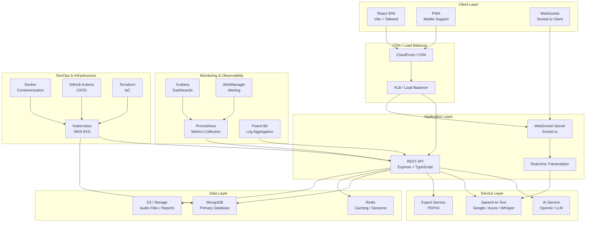
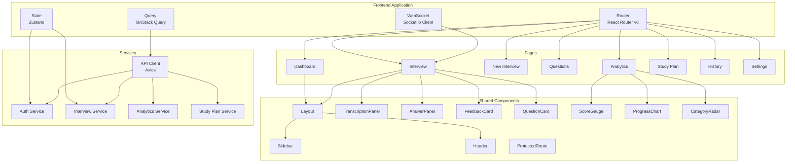
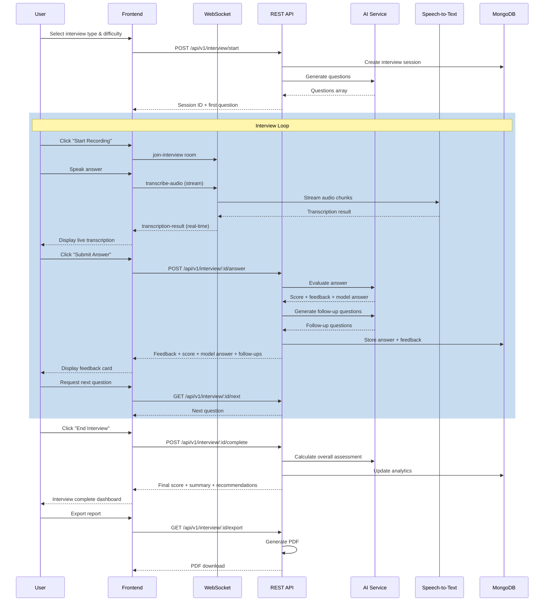

# AI Interview Assistant — Architecture

## System Architecture Overview



## Component Architecture (Frontend)



## Data Flow — Interview Session



## Directory Structure

```
ai-interview-assistant/
├── frontend/                     # React + TypeScript SPA
│   ├── public/                   # Static assets, PWA manifest
│   ├── src/
│   │   ├── components/           # Shared UI components
│   │   ├── pages/                # Route pages
│   │   ├── hooks/                # Custom React hooks
│   │   ├── services/             # API clients, WebSocket
│   │   ├── store/                # Zustand state stores
│   │   ├── types/                # TypeScript interfaces
│   │   ├── utils/                # Formatters, validators
│   │   └── styles/               # Global CSS, Tailwind
│   ├── package.json
│   ├── vite.config.ts
│   └── tailwind.config.js
│
├── backend/                      # Node.js + Express API
│   ├── src/
│   │   ├── config/               # Env, database config
│   │   ├── controllers/          # Route handlers
│   │   ├── models/               # Mongoose schemas
│   │   ├── routes/               # Express route definitions
│   │   ├── middleware/           # Auth, validation, logging
│   │   ├── services/             # Business logic (AI, STT, etc.)
│   │   ├── websocket/            # Socket.io handlers
│   │   ├── types/                # TypeScript types
│   │   └── utils/                # Helpers, constants
│   ├── tests/                    # Jest test suites
│   ├── package.json
│   └── tsconfig.json
│
├── docker/                       # Docker configs
│   ├── Dockerfile.backend
│   ├── Dockerfile.frontend
│   ├── docker-compose.yml
│   └── nginx.conf
│
├── k8s/                          # Kubernetes manifests
│   ├── namespace.yaml
│   ├── configmap.yaml
│   ├── secrets.yaml
│   ├── backend-deployment.yaml
│   ├── backend-service.yaml
│   ├── frontend-deployment.yaml
│   ├── frontend-service.yaml
│   ├── mongodb-deployment.yaml
│   ├── mongodb-service.yaml
│   ├── ingress.yaml
│   ├── hpa.yaml
│   └── pvc.yaml
│
├── monitoring/                   # Observability configs
│   ├── prometheus.yml
│   ├── grafana-dashboard.json
│   ├── fluent-bit.conf
│   └── alertmanager.yml
│
├── database/                     # DB init & seed
│   ├── init.js
│   └── Dockerfile
│
├── .github/workflows/
│   └── ci-cd.yml                 # GitHub Actions pipeline
│
├── scripts/                      # Dev/Deploy scripts
│   ├── setup-dev.sh
│   ├── setup-dev.ps1
│   └── deploy.sh
│
└── docs/
    ├── architecture.md
    └── deployment-guide.md
```

## Technology Stack

| Layer | Technology | Purpose |
|-------|-----------|---------|
| **Frontend** | React 18, TypeScript | UI framework |
| | Vite | Build tool |
| | Tailwind CSS | Styling |
| | React Router v6 | Routing |
| | Zustand | State management |
| | TanStack Query | Server state |
| | Socket.io Client | WebSocket |
| | Recharts | Analytics charts |
| | Framer Motion | Animations |
| **Backend** | Node.js, Express | API server |
| | TypeScript | Type safety |
| | Socket.io | Real-time |
| | Mongoose | ODM |
| | JWT | Auth |
| | Winston | Logging |
| | OpenAI API | LLM integration |
| **Database** | MongoDB 7 | Primary DB |
| | Redis | Caching |
| **Infrastructure** | Docker | Containerization |
| | Kubernetes (EKS) | Orchestration |
| | nginx | Reverse proxy |
| | GitHub Actions | CI/CD |
| **Monitoring** | Prometheus | Metrics |
| | Grafana | Dashboards |
| | Fluent Bit | Log aggregation |
| | AlertManager | Alerting |
